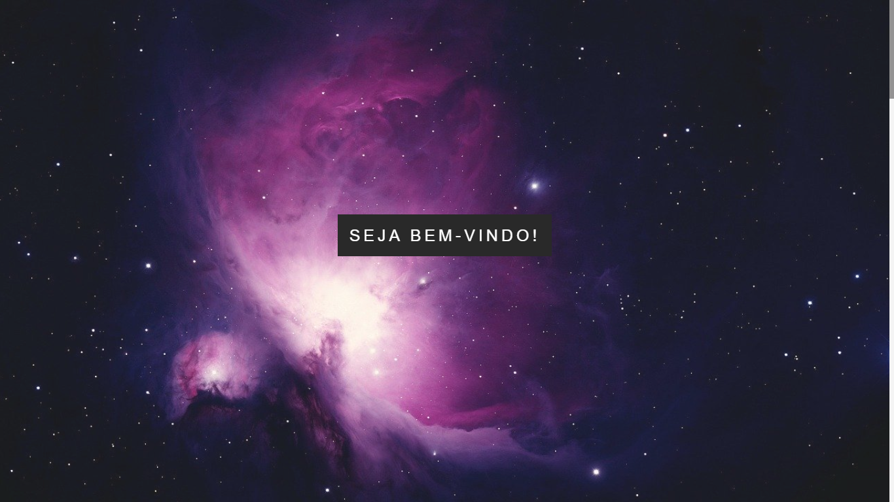
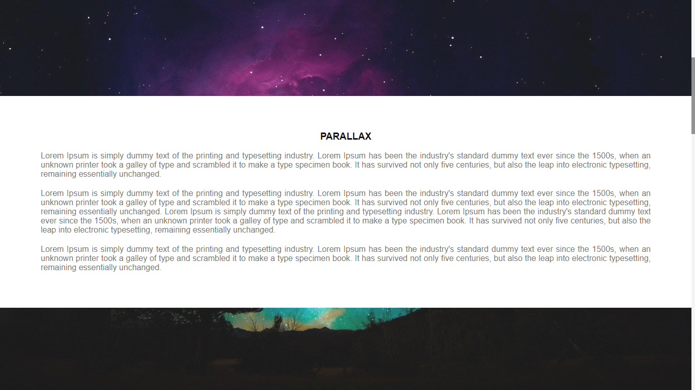
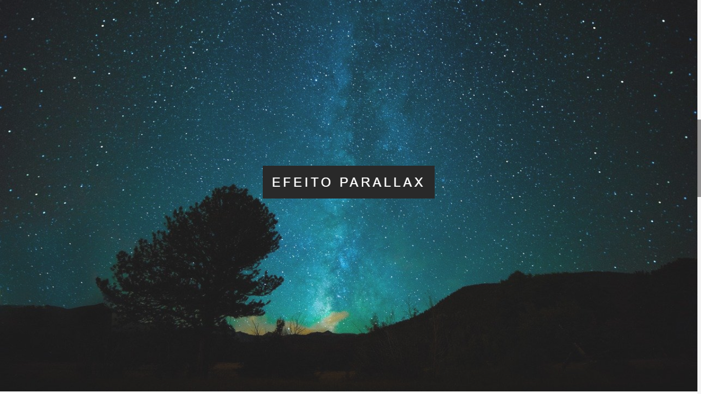

# Efeito Parallax

### Layout de um site utilizando efeito parallax, scrollbar estilizada e favicon.

Este é o meu sexto projeto desenvolvido com o objetivo de colocar em prática os conhecimentos obtidos durante o curso de Desenvolvimento Web. 

Através dos repositórios está sendo possível acompanhar a minha evolução no aprendizado.

### ~ Para este projeto, eu aprendi como utilizar:
* Efeito Parallax
* Estlização da Barra de Rolagem
* Favicon

## Screenshots do site:

